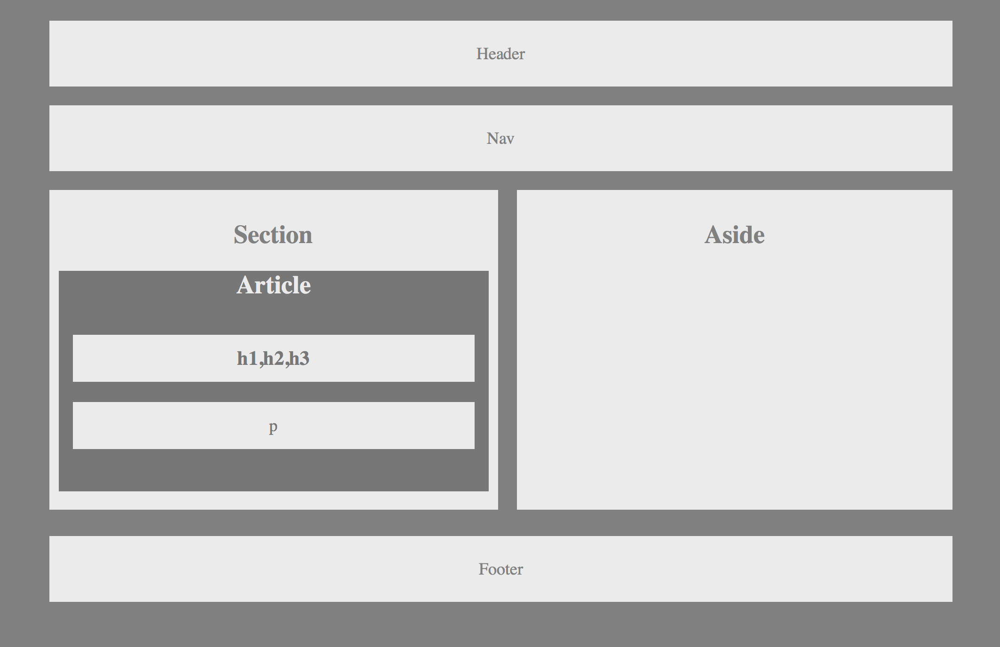

# Title: HW-Wireframe

## Site Picture:


## Technologies Used:
- HTML - used to create elements on the DOM
- CSS - styles html elements on page
- Git - version control system to track changes to source code
- GitHub - hosts repository that can be deployed to GitHub Pages

## Summary:
In this assignment, I built backbone/barebone html file that includes a css file that stack boxes within the wireframe

## Code Snippet:
```html
 <div class="google">
        <section>
            <h2>Section</h2>
            <article>
                <h2>Article</h2>
                <h1>h1,h2,h3</h1>
                <p>p</p>
            </article>
```


## Author Links:
[GitHub] (https://github.com/duongsters)